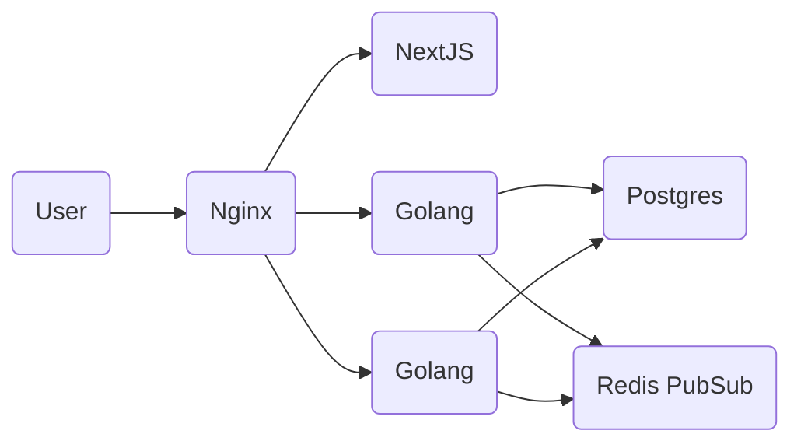

# go-chat  

Real time multi room chat app, built solely for educational purposes.

## ⚡️ Quick Start

1. Install and boot up Docker
2. Run `cp .env.example .env` and tweak it to your needs
3. Run `docker-compose up --build`
4. Go to http://localhost:8080

## ⚙️ Architecture overview

## 💿 Database Design

https://drawsql.app/none-794/diagrams/go-chat/embed

## 🌄 Screenshots

  

  
