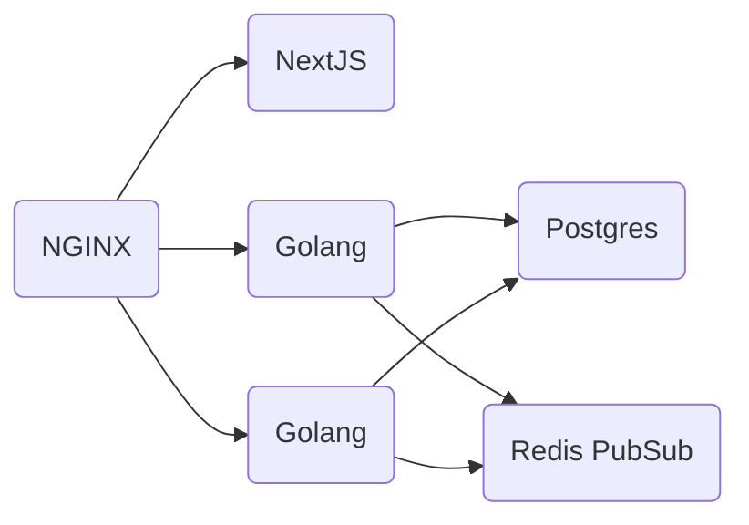

# go-chat [](https://github.com/Dmitry-Ship/go-chat/actions/workflows/front.yml) [](https://github.com/Dmitry-Ship/go-chat/actions/workflows/back.yml)

real time chat app

[https://coverfield.app](https://coverfield.app)

## ⚡️ Quick Start

1. Install and boot up Docker
2. Create `.env` file at root directory taking `.env.example` as a base.
3. Run the following command:

```
docker-compose up --build
```

4. open browser and go to http://localhost:8080

## ☁️ Hosting platforms

- backend: https://console.cloud.google.com/run/detail/us-central1/go-chat/metrics?project=go-playground-311723
- frontend: https://vercel.com/dmitry-ship/go-chat

## ⚙️ Architecture overview


