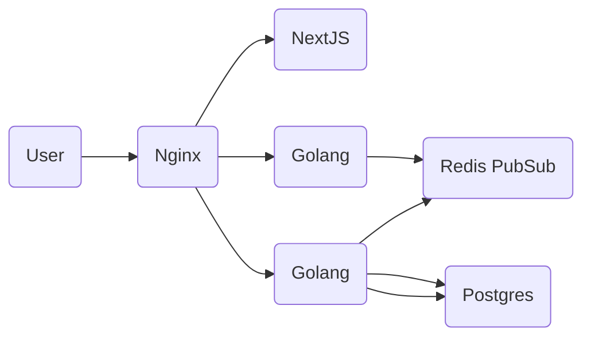

# go-chat [](https://github.com/Dmitry-Ship/go-chat/actions/workflows/front.yml) [](https://github.com/Dmitry-Ship/go-chat/actions/workflows/back.yml)

Real time multi room chat app, built solely for educational purposes.

## ⚡️ Quick Start

1. Install and boot up Docker
2. Create `.env` file at the root directory taking `.env.example` as a base.
3. Run the following command:

```
docker-compose up --build
```

4. Go to http://localhost:8080

## ⚙️ Architecture overview



## 💿 Database Design

https://drawsql.app/none-794/diagrams/go-chat/embed

## 🌄 Screenshots

  


  

 
